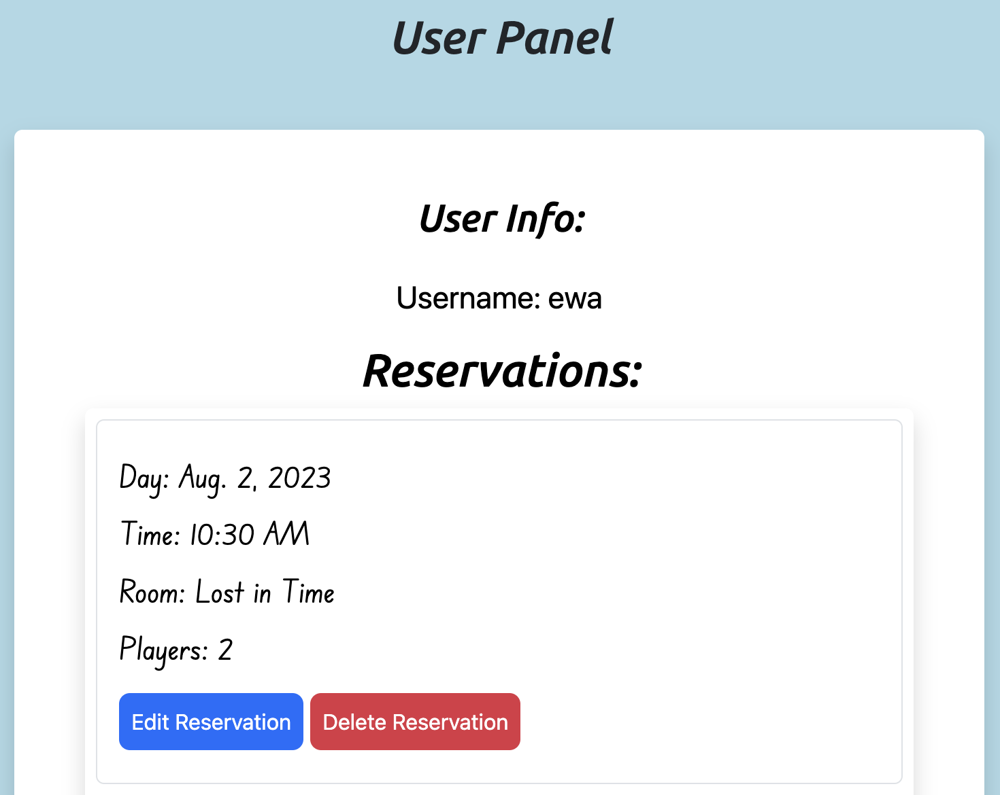
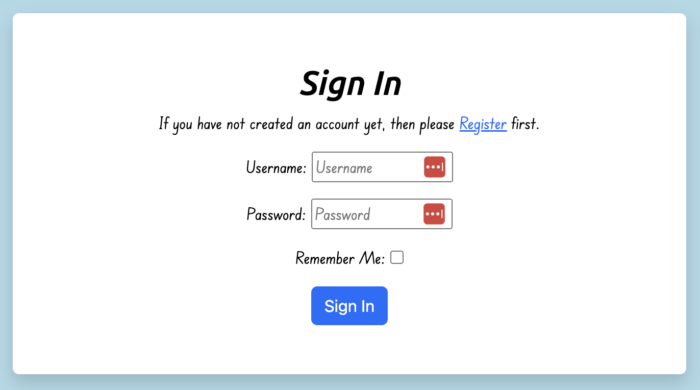

# Puzzled Escape Room


- [Puzzled Escape Room](#puzzled-escape-room)
  - [Introduction](#introduction)
  - [User Stories](#user-stories)
  - [Features](#features)
    - [Navigation bar for unauthenticated users](#navigation-bar-for-unauthenticated-users)
    - [Navigation bar for authenticated users](#navigation-bar-for-authenticated-users)
    - [Footer with social links](#footer-with-social-links)
    - [Home page featuring exciting promotions for our immersive escape rooms](#home-page-featuring-exciting-promotions-for-our-immersive-escape-rooms)
    - [Page dedicated to highlighting the variety of our escape room experiences](#page-dedicated-to-highlighting-the-variety-of-our-escape-room-experiences)
    - [Expandable, in-depth descriptions of each escape room](#expandable-in-depth-descriptions-of-each-escape-room)
    - [Contact Us page providing location, parking information, and contact details such as phone, email and other details](#contact-us-page-providing-location-parking-information-and-contact-details-such-as-phone-email-and-other-details)
    - [User Panel displaying user reservations with options to modify or cancel bookings](#user-panel-displaying-user-reservations-with-options-to-modify-or-cancel-bookings)
    - [Booking room](#booking-room)
    - [Login page](#login-page)
    - [Sign up page](#sign-up-page)
    - [Sign out page](#sign-out-page)
    - [Messages](#messages)
  - [Features To Be Implemented](#features-to-be-implemented)
    - [Languages](#languages)
    - [Frameworks \& Liabraries](#frameworks--liabraries)
  - [Testing](#testing)
  - [Deployment](#deployment)
    - [Cloning the Repository](#cloning-the-repository)
    - [Creating an Application and Postgres Database on Heroku](#creating-an-application-and-postgres-database-on-heroku)
    - [Configuring Cloudinary for hosting the application's images](#configuring-cloudinary-for-hosting-the-applications-images)
    - [Linking the Heroku application to the GitHub repository](#linking-the-heroku-application-to-the-github-repository)
    - [Executing the final deployment steps](#executing-the-final-deployment-steps)
  - [Credits](#credits)

## Introduction

This project is meticulously designed and developed to offer an exceptional user experience for those looking to book an escape room adventure. It provides users with a wide array of room choices and the capability to create, update, and delete their bookings seamlessly. This undertaking serves as my fourth project for the Full Stack Development Diploma program at the Code Institute.

## User Stories

1. **Browse and Choose Escape Room Scenarios** As a potential player I can easily browse and view a list of available escape room scenarios, including their themes and difficulty levels so that I can choose the one that suits my preferences and skill level *IMPLEMENTED*
2. **Intuitive Booking Process** As a player I can access clear and intuitive booking process, allowing me to select a specific date and time slot for the escape room of my choice so that I can complete the reservation with ease *IMPLEMENTED*
3. **Book Multiple Slots for the same Time Slot/Scenario** As a team organizer I can have option to book multiple slots for the same escape room scenario or the same time slot, specifying the number of participants for each slot so that I can facilitate a smooth group experience *Intended for later implementation*
4. **Receive Booking Reminders** As a user I can receive email or SMS notifications to remind me of my upcoming escape room booking so that I can ensure I don't miss the scheduled time *Intended for later implementation*
5. **Provide Location and Logistics Information** As a user I can see clear information about the escape room's location, parking availability, and any other relevant logistics so that I can plan my visit accordingly and avoid any last-minute hassles *IMPLEMENTED*
6. **Read Reviews and Ratings** As a potential customer I can read reviews and ratings from previous players who have experienced each escape room scenario so that I can make informed decisions and ensuring quality experiences *Intended for later implementation*
7. **Manage Availability of Escape Rooms** As a admin I can easily manage the availability of each escape room scenario, including the ability to open or close time slots for bookings so that I can handle logistics *Intended for later implementation*
8. **Manual Booking Management** As a admin I can option to manually add or modify bookings on behalf of customers so that I can provide flexibility in case of special requests or technical issues *Intended for later implementation*
9. **Set Up Promotional Campaigns** As a admin I can set up and manage promotional campaigns or discount codes for specific time periods or target groups so that I can attract more customers and fill up available slots *Intended for later implementation*
10. **User Panel** As a User I can Sign in/Log in to the page so that I can manage my bookings *IMPLEMENTED*


## Features

### Navigation bar for unauthenticated users


### Navigation bar for authenticated users


### Footer with social links


### Home page featuring exciting promotions for our immersive escape rooms


### Page dedicated to highlighting the variety of our escape room experiences


### Expandable, in-depth descriptions of each escape room


### Contact Us page providing location, parking information, and contact details such as phone, email and other details


### User Panel displaying user reservations with options to modify or cancel bookings




### Booking room


### Login page



### Sign up page


### Sign out page


### Messages


## Features To Be Implemented

### Languages

- [HTML5](<https://en.wikipedia.org/wiki/HTML5>)
- [CSS3](<https://en.wikipedia.org/wiki/CSS>)
- [Python](<https://www.python.org/>)

### Frameworks & Liabraries

- [Google Fonts](https://fonts.google.com/) was used for Ubuntu and Edu SA Beginner
- [Font Awesome](<https://fontawesome.com/>) was used for icons
- [Pxhere](https://pxhere.com/) for images used
- [Codeanywhere](<https://codeanywhere.com/>) was utilized for version control, enabling commits to Git and subsequent pushes to GitHub
- [GitHub](<https://github.com/>) project code is stored in a repository after being pushed from Git. Moreover, GitHub served as a platform for the agile development process in this project, specifically through the implementation of User Stories via GitHub Issues
- [Heroku](<https://id.heroku.com/login>) project was deployed using this platform
- [Django](<https://www.djangoproject.com/>) platform served as the framework that facilitated the swift and secure development of the application
- [Bootstrap](<https://getbootstrap.com/>) tool was utilized to construct responsive web pages
- [Gunicorn](<https://gunicorn.org/>) software acted as the web server, enabling Django to run on Heroku
- [ElephantSQL](<https://www.elephantsql.com/>) served as the database for this project
- [dj_database_url](<https://pypi.org/project/dj-database-url/>) library facilitated the connection between database URLs and the PostgreSQL database
- [psycopg2](<https://pypi.org/project/psycopg2/>) database adapter was utilized to enable the connection to the PostgreSQL database
- [Cloudinary](<https://cloudinary.com/>) service was employed for storing the images utilized by the application
- [Django allauth](<https://django-allauth.readthedocs.io/en/latest/index.html>) platform was utilized for account registration and user authentication

## Testing

- **escaperoom_page_view**
  - Test Passed: The escaperoom page loads correctly with no errors, and the 'puzzled' tab is marked active
- **contact**
  - Test Passed: The contact page loads correctly with no errors, and the 'contact' tab is marked active
- **booking**
  - Test Passed: The booking page loads correctly with no errors. A 'POST' request with valid room and day correctly sets the session variables. The 'booking' tab is marked active. Validation is working as expected
- **bookingSubmit**
  - Test Passed: The booking submit page loads correctly. A 'POST' request with valid inputs correctly creates a booking, displays the success message, and redirects to the escaperoom page
  - Test Passed: Date not within the minimum and maximum date range returns error
- **our_rooms**
  - Test Passed: The our_rooms page loads correctly with no errors, and all rooms are correctly displayed. The 'our_rooms' tab is marked active
- **user_panel**
  - Test Passed: The user panel page loads correctly with no errors, and all reservations for the current user are correctly displayed and sorted
- **user_update**
  - Test Passed: The user update page loads correctly with no errors. The selected reservation is correctly loaded, and a 'POST' request with valid room and day correctly sets the session variables and redirects to the user_updateSubmit page
- **user_updateSubmit**
  - Test Passed: The user update submit page loads correctly with no errors. A 'POST' request with valid inputs correctly updates the reservation, displays the success message, and redirects to the user_panel page
- **user_delete**
  - Test Passed: The delete reservation page loads correctly with no errors. A 'POST' request with 'confirm' in the body correctly deletes the reservation, displays the success message, and redirects to the user_panel page
  - Test Passed: Deletion request within 48 hours of the booking return error message
- **login**
  - Test Passed: A user can log in with valid credentials. The user is redirected to the escaperoom page after a successful login
  - Test Passed: A user cannot log in with invalid credentials. An appropriate error message is displayed
  - Test Passed: Attempting to login with empty fields 'username and/or password' shows an appropriate error message
- **logout**
  - Test Passed: A logged-in user can successfully log out. After logout, the user is redirected to escaperoom page
- **signup**
  - Test Passed: A user can successfully sign up with valid details. An appropriate success message is displayed, and the user is redirected to the escaperoom page
  - Test Passed: A user cannot sign up with invalid details 'such as mismatching passwords, a username that is already in use'. An appropriate error message is displayed
  - Test Passed: Attempting to sign up with empty fields displays an appropriate error message
- **navigation**
  - Test Passed: While not login user can't see Booking, User Panel or Logout tab but can see Register and Login tab
  - Test Passed: While login user can see Bookin, User Panel and Logout tab but can't see Register and Login tab

- **W3C Validator**


## Deployment

Outlined below are the comprehensive instructions for cloning this project repository, along with the guidelines to configure and deploy the application. A condensed version of the deployment process is made available by the Code Institute: CI Cheat Sheet and within the walkthrough project.

### Cloning the Repository

- Visit the repository [Puzzled Escape Room](https://github.com/Ellusive89/puzzled-escape-room) on GitHub
- To the right of the screen, click on the "Code" button. Switch to the HTTPs section and copy the provided link.
- Launch a GitBash terminal and navigate to the directory where you intend to create the clone.
- On the command line, enter ```git clone```, paste the previously copied URL, and press the Enter key to initiate the cloning process.
- After cloning, install the necessary packages for the application by typing ```pip install -r requirements.txt```
- If you are developing and running the application locally, set ```DEBUG=True``` in the **settings.py** file.
- Any changes made to the local clone can be committed back to the repository with these commands:
  - ```git add [filenames]``` ,or use ```git add .``` to add all changed files
  - ```git commit -m "a descriptive message about changes"```
  - ```git push```
Note: Any changes pushed to the main branch will reflect on the live project after re-deployment from Heroku.

### Creating an Application and Postgres Database on Heroku

- Visit [Heroku](https://www.heroku.com/) and log in, or create a new account if necessary
- From the Heroku dashboard, click the **Create new app** button. If you have a new account, an icon will be displayed on the screen to **Create an app**, or find this option under the **New** dropdown menu at the top right of the screen
- On the **Create New App** page, provide a unique name for the application, select a region, and click **Create app**
- On the **Application Configuration** page for your new app, click on the **Resources** tab
- In the **Add-ons** search bar, type **Postgres** and select **Heroku Postgres** from the dropdown list. Then, click the **Submit Order Form** button in the pop-up dialog
- Go back to **Settings** on the **Application Configuration** page and click on the **Reveal Config Vars** button. Ensure the ```DATABASE_URL``` has been set up automatically
- Add a new Config Var named ```DISABLE_COLLECTSTATIC``` and set its value to 1
- Create another Config Var named ```SECRET_KEY``` and assign it a value. This can be any random string of letters, digits, and symbols
- Update the **settings.py** file to use the ```DATABASE_URL``` and ```SECRET_KEY``` environment variable values
- In Gitpod, within the project terminal window, initialize the data model in the Postgres database by running the command: ```python3 manage.py migrate```
- Make sure the project's **requirements.txt** file is updated with all necessary supporting files. Enter the command: ```pip3 freeze --local > requirements.txt```
- Commit and push any local changes to GitHub
- To run the application on localhost, add ```SECRET_KEY``` and ```DATABASE_URL``` along with their respective values to the **env.py** file

### Configuring Cloudinary for hosting the application's images

- Visit [Cloudinary](https://cloudinary.com/) and log in, or create an account if necessary. During account creation, provide your name, email, and a password. For **primary interest**, select **Programmable Media for image and video API**. After clicking **Create Account**, you'll receive an email to verify your account, which will redirect you to the dashboard
- From the dashboard, click on the **Copy to clipboard** link to copy the **API Environment variable** value
- Log into [Heroku[(<https://www.heroku.com/>) and navigate to the **Application Configuration** page for your application. Click on **Settings** and then click on the **Reveal Config Vars** button
- Add a new Config Var named ```CLOUDINARY_URL```. Paste the value copied from the Cloudinary dashboard, but remember to remove the ```CLOUDINARY_URL=``` prefix from the string
- To enable the application to run on localhost, add the ```CLOUDINARY_URL``` environment variable and its value to your **env.py** file

### Linking the Heroku application to the GitHub repository

- Visit the **Application Configuration** page for your application on Heroku and click on the **Deploy** tab
- Choose **GitHub** as your Deployment Method. If requested, confirm the connection to GitHub. Enter the name of your GitHub repository and click **Connect**. This will link the Heroku app with the code in your GitHub repository
- Scroll down to the **Automatic deploys** section. Here, you can opt to either **Enable Automatic Deploys**, which will deploy every time changes are pushed to GitHub, or use the **Manual Deploy** option. For this project, select **Manual Deploy**
- You can now run the application directly from the **Application Configuration** page by clicking on the **Open App** button

### Executing the final deployment steps

- In the **settings.py** file, set the ```DEBUG``` flag to ```False```
- Make sure that **requirements.txt** is up-to-date. You can use the command ```pip3 freeze --local > requirements.txt``` to achieve this
- Push your files to GitHub
- In the **Heroku Config Vars** for the application, delete the ```DISABLE_COLLECTSTATIC``` environment variable
- Visit the **Heroku dashboard** and navigate to the **Deploy** tab for your application. Click **Deploy Branch** to initiate the deployment

After completing these steps, the application will be live. You can access the deployed application at this link: [Puzzled Escape Room](https://puzzled-escaperoom-0a01ce260114.herokuapp.com/escaperoom.html)

## Credits

- The majority of the coding and testing processes are based on the information provided in the "Hello Django" and "I Think Therefore I Blog" walkthroughs, which are part of the Full Stack Frameworks module at Code Institute
- When faced with uncertainties during the development process, I relied on resources such as Stack Overflow, Bootstrap's documentation, and Django's official documentation for guidance and solutions. I also utilized guides and tutorials available on YouTube for additional assistance and insights
- Foremost, I would like to express my deepest gratitude to my husband for his unwavering support. During times when I felt like giving up, he provided the encouragement I needed to keep going. Without his support, completing this assignment would not have been possible.
